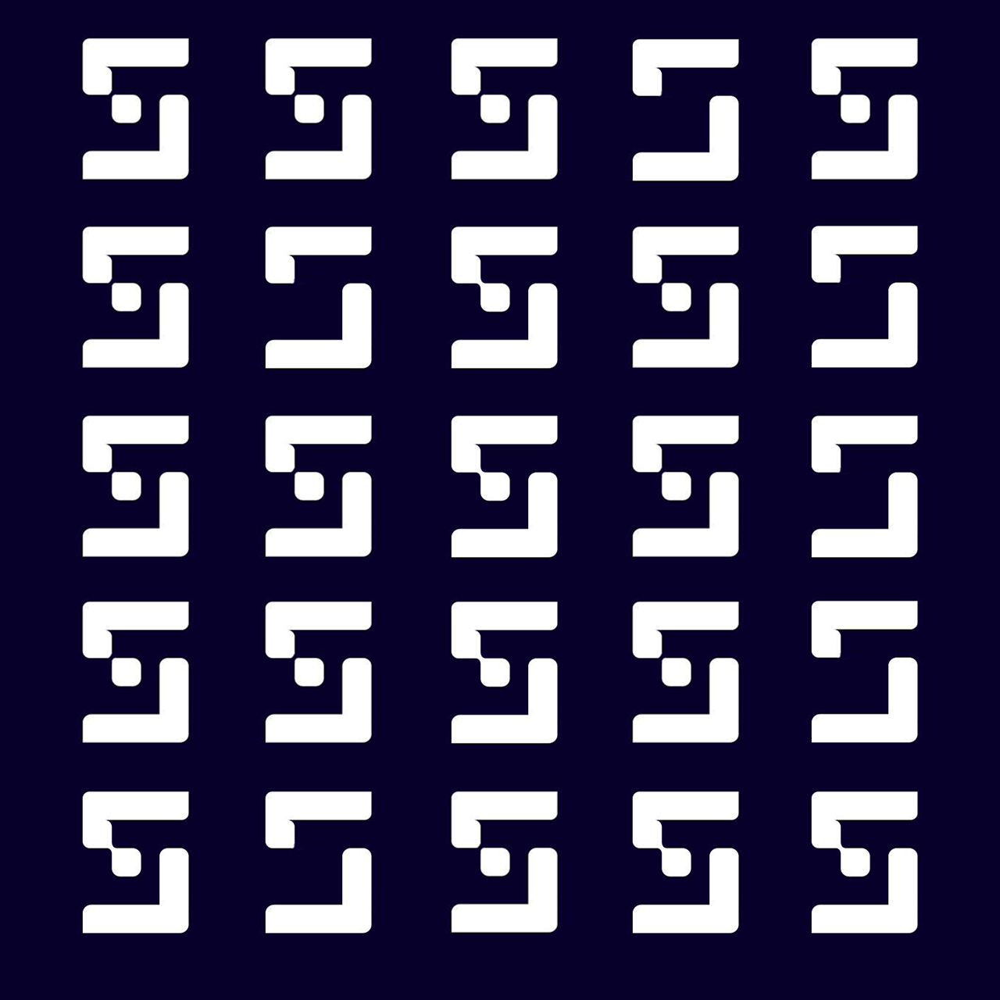

# LogoMania (Crypto)

## Description (problem statement)

The design team sent us this weird looking picture but we can't figure out what it is for... They also told us to use our telegraph? This is not the 19th century!

## Summary (solution)

This can be easily solved with morse code after figuring out the meaning of the different logos:

- The logos with the detached square in the middle are dots.
- The ones with the attached square are dashes.
- The empty logos are just spaces.

After this, you get ... .. -. ..-. ..-. - .-- , which can be decoded to `sinfftw`

## Related resources

Inspired in the game [Cypher](https://store.steampowered.com/app/746710/Cypher/) (level 1.7)
