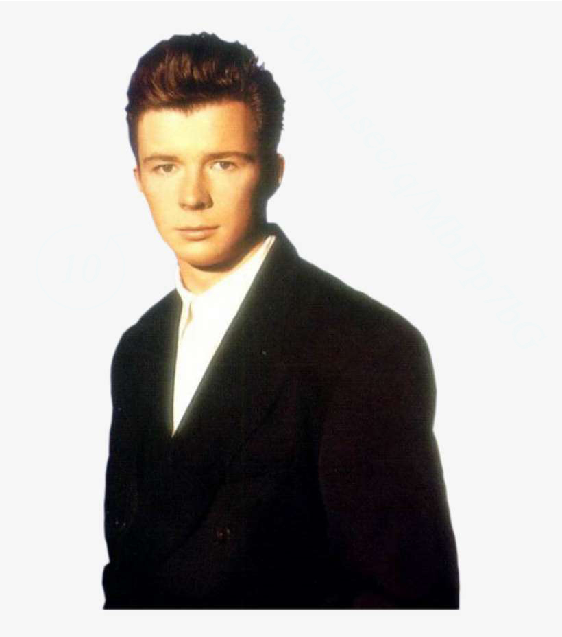
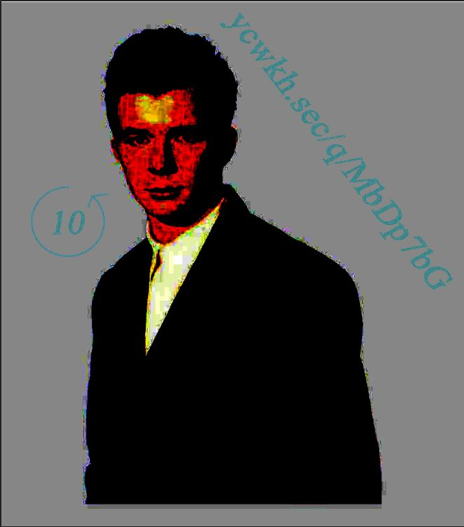

# Rickysterious (Forensics)

## Description (problem statement)

There was a really suspicious profile appearing in the website. At first I thought it was just a troll but it seems like he is hiding something...

## Summary (solution)

The flag is split in two halves, both hidden in the picture attached:

- By tweaking the picture's color levels (with photoshop or another image editor) you can find hidden information in the background. You see this text `ycwkh.sec/q/MbDp7bG` and a circular arrow with a 10 in the middle. You use ROT13 with 10 characters to get this url: https://imgur.com/a/WlNz7lQ
- The final part of the flag can be found in the image's metadata, in the author's section.

With this, you get the flag `SINFCTF2021{h3ll0_fr13nd_f1n4l_p4rt}`

## Related resources

